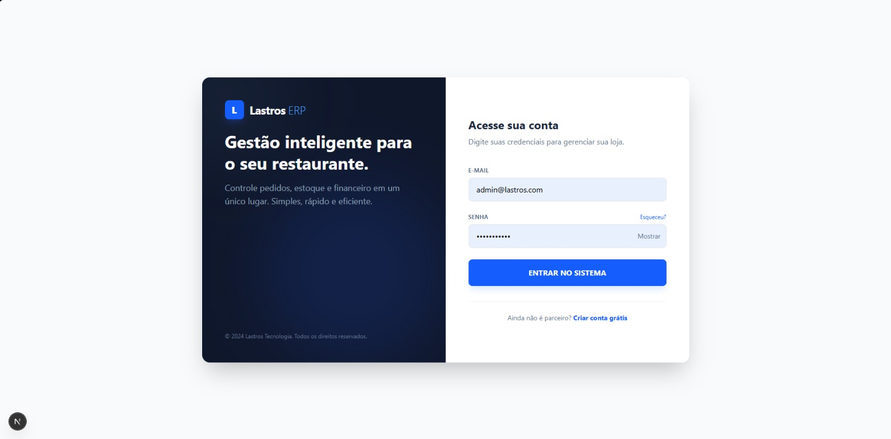

<div id="top">

<!-- HEADER STYLE: CLASSIC -->
<div align="center">



# LASTROS-ERP

<em></em>

<!-- BADGES -->


<!-- default option, no dependency badges. -->


<!-- default option, no dependency badges. -->

</div>
<br>

---

## Table of Contents

- [Table of Contents](#table-of-contents)
- [Overview](#overview)
- [Features](#features)
- [Project Structure](#project-structure)
    - [Project Index](#project-index)
- [Getting Started](#getting-started)
    - [Prerequisites](#prerequisites)
    - [Installation](#installation)
    - [Usage](#usage)
    - [Testing](#testing)
- [Roadmap](#roadmap)
- [Contributing](#contributing)
- [License](#license)
- [Acknowledgments](#acknowledgments)

---

## Overview

🚀 Lastros ERP - Sistema de Gestão para Restaurantes
O Lastros é uma plataforma completa de gestão desenvolvida para simplificar a operação de restaurantes, bares e lanchonetes. O sistema centraliza desde o atendimento na frente de caixa até o controle financeiro e de estoque em uma interface moderna e intuitiva.

📋 Visão Geral
O projeto foi concebido para resolver a fragmentação de processos em estabelecimentos gastronômicos. Com o Lastros, o gestor tem uma visão 360° do negócio em tempo real, permitindo decisões rápidas baseadas em dados concretos de vendas e produtividade.

✨ Funcionalidades Principais
Dashboard Operacional: Visualização instantânea de KPIs como vendas do dia, ticket médio, pedidos em aberto e estimativa de lucro.

Frente de Caixa (PDV): Interface otimizada para lançamento rápido de pedidos e fechamento de contas.

Gestão de Estoque: Controle rigoroso de insumos com alertas de níveis baixos e histórico de movimentações.

Monitor de Cozinha: Visualização de comandas em tempo real para a equipe de produção, garantindo agilidade no preparo.

Análise de Vendas: Gráficos detalhados de desempenho (Vendas x Hora) para identificar períodos de maior demanda.

Controle Financeiro: Gestão de fluxo de caixa e relatórios gerenciais simples e eficazes.

🛠️ Tecnologias Utilizadas
O ecossistema Lastros utiliza tecnologias de ponta para garantir performance e escalabilidade:

Frontend: React com Next.js (App Router), Tailwind CSS e Chart.js.

Backend: Node.js com NestJS (ou Express) e integração com banco de dados.

Infraestrutura: Docker para padronização de ambientes.

Design System: Focado em UX/UI minimalista com tons de azul e cinza para reduzir o cansaço visual.


---

## Features

<code>❯ REPLACE-ME</code>

---

## Project Structure

```sh
└── lastros-erp/
    ├── backend
    │   ├── .gitignore
    │   ├── .prettierrc
    │   ├── README.md
    │   ├── eslint.config.mjs
    │   ├── nest-cli.json
    │   ├── package-lock.json
    │   ├── package.json
    │   ├── prisma
    │   ├── src
    │   ├── test
    │   ├── tsconfig.build.json
    │   └── tsconfig.json
    ├── docker-compose.yml
    └── frontend
        ├── .gitignore
        ├── app
        ├── components
        ├── eslint.config.mjs
        ├── lib
        ├── next.config.ts
        ├── package-lock.json
        ├── package.json
        ├── postcss.config.mjs
        ├── public
        └── tsconfig.json
```

### Project Index

<details open>
	<summary><b><code>LASTROS-ERP/</code></b></summary>
	<!-- __root__ Submodule -->
	<details>
		<summary><b>__root__</b></summary>
		<blockquote>
			<div class='directory-path' style='padding: 8px 0; color: #666;'>
				<code><b>⦿ __root__</b></code>
			<table style='width: 100%; border-collapse: collapse;'>
			<thead>
				<tr style='background-color: #f8f9fa;'>
					<th style='width: 30%; text-align: left; padding: 8px;'>File Name</th>
					<th style='text-align: left; padding: 8px;'>Summary</th>
				</tr>
			</thead>
				<tr style='border-bottom: 1px solid #eee;'>
					<td style='padding: 8px;'><b><a href='https://github.com/Liozn-dev/lastros-erp/blob/master/docker-compose.yml'>docker-compose.yml</a></b></td>
					<td style='padding: 8px;'>Code>❯ REPLACE-ME</code></td>
				</tr>
			</table>
		</blockquote>
	</details>
	<!-- backend Submodule -->
	<details>
		<summary><b>backend</b></summary>
		<blockquote>
			<div class='directory-path' style='padding: 8px 0; color: #666;'>
				<code><b>⦿ backend</b></code>
			<table style='width: 100%; border-collapse: collapse;'>
			<thead>
				<tr style='background-color: #f8f9fa;'>
					<th style='width: 30%; text-align: left; padding: 8px;'>File Name</th>
					<th style='text-align: left; padding: 8px;'>Summary</th>
				</tr>
			</thead>
				<tr style='border-bottom: 1px solid #eee;'>
					<td style='padding: 8px;'><b><a href='https://github.com/Liozn-dev/lastros-erp/blob/master/backend/tsconfig.json'>tsconfig.json</a></b></td>
					<td style='padding: 8px;'>Code>❯ REPLACE-ME</code></td>
				</tr>
				<tr style='border-bottom: 1px solid #eee;'>
					<td style='padding: 8px;'><b><a href='https://github.com/Liozn-dev/lastros-erp/blob/master/backend/.prettierrc'>.prettierrc</a></b></td>
					<td style='padding: 8px;'>Code>❯ REPLACE-ME</code></td>
				</tr>
				<tr style='border-bottom: 1px solid #eee;'>
					<td style='padding: 8px;'><b><a href='https://github.com/Liozn-dev/lastros-erp/blob/master/backend/nest-cli.json'>nest-cli.json</a></b></td>
					<td style='padding: 8px;'>Code>❯ REPLACE-ME</code></td>
				</tr>
				<tr style='border-bottom: 1px solid #eee;'>
					<td style='padding: 8px;'><b><a href='https://github.com/Liozn-dev/lastros-erp/blob/master/backend/eslint.config.mjs'>eslint.config.mjs</a></b></td>
					<td style='padding: 8px;'>Code>❯ REPLACE-ME</code></td>
				</tr>
				<tr style='border-bottom: 1px solid #eee;'>
					<td style='padding: 8px;'><b><a href='https://github.com/Liozn-dev/lastros-erp/blob/master/backend/package-lock.json'>package-lock.json</a></b></td>
					<td style='padding: 8px;'>Code>❯ REPLACE-ME</code></td>
				</tr>
				<tr style='border-bottom: 1px solid #eee;'>
					<td style='padding: 8px;'><b><a href='https://github.com/Liozn-dev/lastros-erp/blob/master/backend/package.json'>package.json</a></b></td>
					<td style='padding: 8px;'>Code>❯ REPLACE-ME</code></td>
				</tr>
				<tr style='border-bottom: 1px solid #eee;'>
					<td style='padding: 8px;'><b><a href='https://github.com/Liozn-dev/lastros-erp/blob/master/backend/tsconfig.build.json'>tsconfig.build.json</a></b></td>
					<td style='padding: 8px;'>Code>❯ REPLACE-ME</code></td>
				</tr>
			</table>
			<!-- prisma Submodule -->
			<details>
				<summary><b>prisma</b></summary>
				<blockquote>
					<div class='directory-path' style='padding: 8px 0; color: #666;'>
						<code><b>⦿ backend.prisma</b></code>
					<table style='width: 100%; border-collapse: collapse;'>
					<thead>
						<tr style='background-color: #f8f9fa;'>
							<th style='width: 30%; text-align: left; padding: 8px;'>File Name</th>
							<th style='text-align: left; padding: 8px;'>Summary</th>
						</tr>
					</thead>
						<tr style='border-bottom: 1px solid #eee;'>
							<td style='padding: 8px;'><b><a href='https://github.com/Liozn-dev/lastros-erp/blob/master/backend/prisma/schema.prisma'>schema.prisma</a></b></td>
							<td style='padding: 8px;'>Code>❯ REPLACE-ME</code></td>
						</tr>
						<tr style='border-bottom: 1px solid #eee;'>
							<td style='padding: 8px;'><b><a href='https://github.com/Liozn-dev/lastros-erp/blob/master/backend/prisma/reset-admin-password.js'>reset-admin-password.js</a></b></td>
							<td style='padding: 8px;'>Code>❯ REPLACE-ME</code></td>
						</tr>
						<tr style='border-bottom: 1px solid #eee;'>
							<td style='padding: 8px;'><b><a href='https://github.com/Liozn-dev/lastros-erp/blob/master/backend/prisma/seed.ts'>seed.ts</a></b></td>
							<td style='padding: 8px;'>Code>❯ REPLACE-ME</code></td>
						</tr>
					</table>
					<!-- migrations Submodule -->
					<details>
						<summary><b>migrations</b></summary>
						<blockquote>
							<div class='directory-path' style='padding: 8px 0; color: #666;'>
								<code><b>⦿ backend.prisma.migrations</b></code>
							<table style='width: 100%; border-collapse: collapse;'>
							<thead>
								<tr style='background-color: #f8f9fa;'>
									<th style='width: 30%; text-align: left; padding: 8px;'>File Name</th>
									<th style='text-align: left; padding: 8px;'>Summary</th>
								</tr>
							</thead>
								<tr style='border-bottom: 1px solid #eee;'>
									<td style='padding: 8px;'><b><a href='https://github.com/Liozn-dev/lastros-erp/blob/master/backend/prisma/migrations/migration_lock.toml'>migration_lock.toml</a></b></td>
									<td style='padding: 8px;'>Code>❯ REPLACE-ME</code></td>
								</tr>
							</table>
							<!-- 20260211052900_init_orders Submodule -->
							<details>
								<summary><b>20260211052900_init_orders</b></summary>
								<blockquote>
									<div class='directory-path' style='padding: 8px 0; color: #666;'>
										<code><b>⦿ backend.prisma.migrations.20260211052900_init_orders</b></code>
									<table style='width: 100%; border-collapse: collapse;'>
									<thead>
										<tr style='background-color: #f8f9fa;'>
											<th style='width: 30%; text-align: left; padding: 8px;'>File Name</th>
											<th style='text-align: left; padding: 8px;'>Summary</th>
										</tr>
									</thead>
										<tr style='border-bottom: 1px solid #eee;'>
											<td style='padding: 8px;'><b><a href='https://github.com/Liozn-dev/lastros-erp/blob/master/backend/prisma/migrations/20260211052900_init_orders/migration.sql'>migration.sql</a></b></td>
											<td style='padding: 8px;'>Code>❯ REPLACE-ME</code></td>
										</tr>
									</table>
								</blockquote>
							</details>
							<!-- 20260210201429_init Submodule -->
							<details>
								<summary><b>20260210201429_init</b></summary>
								<blockquote>
									<div class='directory-path' style='padding: 8px 0; color: #666;'>
										<code><b>⦿ backend.prisma.migrations.20260210201429_init</b></code>
									<table style='width: 100%; border-collapse: collapse;'>
									<thead>
										<tr style='background-color: #f8f9fa;'>
											<th style='width: 30%; text-align: left; padding: 8px;'>File Name</th>
											<th style='text-align: left; padding: 8px;'>Summary</th>
										</tr>
									</thead>
										<tr style='border-bottom: 1px solid #eee;'>
											<td style='padding: 8px;'><b><a href='https://github.com/Liozn-dev/lastros-erp/blob/master/backend/prisma/migrations/20260210201429_init/migration.sql'>migration.sql</a></b></td>
											<td style='padding: 8px;'>Code>❯ REPLACE-ME</code></td>
										</tr>
									</table>
								</blockquote>
							</details>
						</blockquote>
					</details>
				</blockquote>
			</details>
			<!-- src Submodule -->
			<details>
				<summary><b>src</b></summary>
				<blockquote>
					<div class='directory-path' style='padding: 8px 0; color: #666;'>
						<code><b>⦿ backend.src</b></code>
					<table style='width: 100%; border-collapse: collapse;'>
					<thead>
						<tr style='background-color: #f8f9fa;'>
							<th style='width: 30%; text-align: left; padding: 8px;'>File Name</th>
							<th style='text-align: left; padding: 8px;'>Summary</th>
						</tr>
					</thead>
						<tr style='border-bottom: 1px solid #eee;'>
							<td style='padding: 8px;'><b><a href='https://github.com/Liozn-dev/lastros-erp/blob/master/backend/src/app.module.ts'>app.module.ts</a></b></td>
							<td style='padding: 8px;'>Code>❯ REPLACE-ME</code></td>
						</tr>
						<tr style='border-bottom: 1px solid #eee;'>
							<td style='padding: 8px;'><b><a href='https://github.com/Liozn-dev/lastros-erp/blob/master/backend/src/app.controller.spec.ts'>app.controller.spec.ts</a></b></td>
							<td style='padding: 8px;'>Code>❯ REPLACE-ME</code></td>
						</tr>
						<tr style='border-bottom: 1px solid #eee;'>
							<td style='padding: 8px;'><b><a href='https://github.com/Liozn-dev/lastros-erp/blob/master/backend/src/app.service.ts'>app.service.ts</a></b></td>
							<td style='padding: 8px;'>Code>❯ REPLACE-ME</code></td>
						</tr>
						<tr style='border-bottom: 1px solid #eee;'>
							<td style='padding: 8px;'><b><a href='https://github.com/Liozn-dev/lastros-erp/blob/master/backend/src/main.ts'>main.ts</a></b></td>
							<td style='padding: 8px;'>Code>❯ REPLACE-ME</code></td>
						</tr>
						<tr style='border-bottom: 1px solid #eee;'>
							<td style='padding: 8px;'><b><a href='https://github.com/Liozn-dev/lastros-erp/blob/master/backend/src/prisma.service.ts'>prisma.service.ts</a></b></td>
							<td style='padding: 8px;'>Code>❯ REPLACE-ME</code></td>
						</tr>
						<tr style='border-bottom: 1px solid #eee;'>
							<td style='padding: 8px;'><b><a href='https://github.com/Liozn-dev/lastros-erp/blob/master/backend/src/app.controller.ts'>app.controller.ts</a></b></td>
							<td style='padding: 8px;'>Code>❯ REPLACE-ME</code></td>
						</tr>
					</table>
					<!-- products Submodule -->
					<details>
						<summary><b>products</b></summary>
						<blockquote>
							<div class='directory-path' style='padding: 8px 0; color: #666;'>
								<code><b>⦿ backend.src.products</b></code>
							<table style='width: 100%; border-collapse: collapse;'>
							<thead>
								<tr style='background-color: #f8f9fa;'>
									<th style='width: 30%; text-align: left; padding: 8px;'>File Name</th>
									<th style='text-align: left; padding: 8px;'>Summary</th>
								</tr>
							</thead>
								<tr style='border-bottom: 1px solid #eee;'>
									<td style='padding: 8px;'><b><a href='https://github.com/Liozn-dev/lastros-erp/blob/master/backend/src/products/products.controller.ts'>products.controller.ts</a></b></td>
									<td style='padding: 8px;'>Code>❯ REPLACE-ME</code></td>
								</tr>
								<tr style='border-bottom: 1px solid #eee;'>
									<td style='padding: 8px;'><b><a href='https://github.com/Liozn-dev/lastros-erp/blob/master/backend/src/products/products.controller.spec.ts'>products.controller.spec.ts</a></b></td>
									<td style='padding: 8px;'>Code>❯ REPLACE-ME</code></td>
								</tr>
								<tr style='border-bottom: 1px solid #eee;'>
									<td style='padding: 8px;'><b><a href='https://github.com/Liozn-dev/lastros-erp/blob/master/backend/src/products/products.module.ts'>products.module.ts</a></b></td>
									<td style='padding: 8px;'>Code>❯ REPLACE-ME</code></td>
								</tr>
								<tr style='border-bottom: 1px solid #eee;'>
									<td style='padding: 8px;'><b><a href='https://github.com/Liozn-dev/lastros-erp/blob/master/backend/src/products/products.service.ts'>products.service.ts</a></b></td>
									<td style='padding: 8px;'>Code>❯ REPLACE-ME</code></td>
								</tr>
								<tr style='border-bottom: 1px solid #eee;'>
									<td style='padding: 8px;'><b><a href='https://github.com/Liozn-dev/lastros-erp/blob/master/backend/src/products/products.service.spec.ts'>products.service.spec.ts</a></b></td>
									<td style='padding: 8px;'>Code>❯ REPLACE-ME</code></td>
								</tr>
							</table>
							<!-- entities Submodule -->
							<details>
								<summary><b>entities</b></summary>
								<blockquote>
									<div class='directory-path' style='padding: 8px 0; color: #666;'>
										<code><b>⦿ backend.src.products.entities</b></code>
									<table style='width: 100%; border-collapse: collapse;'>
									<thead>
										<tr style='background-color: #f8f9fa;'>
											<th style='width: 30%; text-align: left; padding: 8px;'>File Name</th>
											<th style='text-align: left; padding: 8px;'>Summary</th>
										</tr>
									</thead>
										<tr style='border-bottom: 1px solid #eee;'>
											<td style='padding: 8px;'><b><a href='https://github.com/Liozn-dev/lastros-erp/blob/master/backend/src/products/entities/product.entity.ts'>product.entity.ts</a></b></td>
											<td style='padding: 8px;'>Code>❯ REPLACE-ME</code></td>
										</tr>
									</table>
								</blockquote>
							</details>
							<!-- dto Submodule -->
							<details>
								<summary><b>dto</b></summary>
								<blockquote>
									<div class='directory-path' style='padding: 8px 0; color: #666;'>
										<code><b>⦿ backend.src.products.dto</b></code>
									<table style='width: 100%; border-collapse: collapse;'>
									<thead>
										<tr style='background-color: #f8f9fa;'>
											<th style='width: 30%; text-align: left; padding: 8px;'>File Name</th>
											<th style='text-align: left; padding: 8px;'>Summary</th>
										</tr>
									</thead>
										<tr style='border-bottom: 1px solid #eee;'>
											<td style='padding: 8px;'><b><a href='https://github.com/Liozn-dev/lastros-erp/blob/master/backend/src/products/dto/create-product.dto.ts'>create-product.dto.ts</a></b></td>
											<td style='padding: 8px;'>Code>❯ REPLACE-ME</code></td>
										</tr>
										<tr style='border-bottom: 1px solid #eee;'>
											<td style='padding: 8px;'><b><a href='https://github.com/Liozn-dev/lastros-erp/blob/master/backend/src/products/dto/update-product.dto.ts'>update-product.dto.ts</a></b></td>
											<td style='padding: 8px;'>Code>❯ REPLACE-ME</code></td>
										</tr>
									</table>
								</blockquote>
							</details>
						</blockquote>
					</details>
					<!-- orders Submodule -->
					<details>
						<summary><b>orders</b></summary>
						<blockquote>
							<div class='directory-path' style='padding: 8px 0; color: #666;'>
								<code><b>⦿ backend.src.orders</b></code>
							<table style='width: 100%; border-collapse: collapse;'>
							<thead>
								<tr style='background-color: #f8f9fa;'>
									<th style='width: 30%; text-align: left; padding: 8px;'>File Name</th>
									<th style='text-align: left; padding: 8px;'>Summary</th>
								</tr>
							</thead>
								<tr style='border-bottom: 1px solid #eee;'>
									<td style='padding: 8px;'><b><a href='https://github.com/Liozn-dev/lastros-erp/blob/master/backend/src/orders/orders.module.ts'>orders.module.ts</a></b></td>
									<td style='padding: 8px;'>Code>❯ REPLACE-ME</code></td>
								</tr>
								<tr style='border-bottom: 1px solid #eee;'>
									<td style='padding: 8px;'><b><a href='https://github.com/Liozn-dev/lastros-erp/blob/master/backend/src/orders/orders.service.ts'>orders.service.ts</a></b></td>
									<td style='padding: 8px;'>Code>❯ REPLACE-ME</code></td>
								</tr>
								<tr style='border-bottom: 1px solid #eee;'>
									<td style='padding: 8px;'><b><a href='https://github.com/Liozn-dev/lastros-erp/blob/master/backend/src/orders/orders.service.spec.ts'>orders.service.spec.ts</a></b></td>
									<td style='padding: 8px;'>Code>❯ REPLACE-ME</code></td>
								</tr>
								<tr style='border-bottom: 1px solid #eee;'>
									<td style='padding: 8px;'><b><a href='https://github.com/Liozn-dev/lastros-erp/blob/master/backend/src/orders/orders.controller.ts'>orders.controller.ts</a></b></td>
									<td style='padding: 8px;'>Code>❯ REPLACE-ME</code></td>
								</tr>
								<tr style='border-bottom: 1px solid #eee;'>
									<td style='padding: 8px;'><b><a href='https://github.com/Liozn-dev/lastros-erp/blob/master/backend/src/orders/orders.controller.spec.ts'>orders.controller.spec.ts</a></b></td>
									<td style='padding: 8px;'>Code>❯ REPLACE-ME</code></td>
								</tr>
							</table>
							<!-- entities Submodule -->
							<details>
								<summary><b>entities</b></summary>
								<blockquote>
									<div class='directory-path' style='padding: 8px 0; color: #666;'>
										<code><b>⦿ backend.src.orders.entities</b></code>
									<table style='width: 100%; border-collapse: collapse;'>
									<thead>
										<tr style='background-color: #f8f9fa;'>
											<th style='width: 30%; text-align: left; padding: 8px;'>File Name</th>
											<th style='text-align: left; padding: 8px;'>Summary</th>
										</tr>
									</thead>
										<tr style='border-bottom: 1px solid #eee;'>
											<td style='padding: 8px;'><b><a href='https://github.com/Liozn-dev/lastros-erp/blob/master/backend/src/orders/entities/order.entity.ts'>order.entity.ts</a></b></td>
											<td style='padding: 8px;'>Code>❯ REPLACE-ME</code></td>
										</tr>
									</table>
								</blockquote>
							</details>
							<!-- dto Submodule -->
							<details>
								<summary><b>dto</b></summary>
								<blockquote>
									<div class='directory-path' style='padding: 8px 0; color: #666;'>
										<code><b>⦿ backend.src.orders.dto</b></code>
									<table style='width: 100%; border-collapse: collapse;'>
									<thead>
										<tr style='background-color: #f8f9fa;'>
											<th style='width: 30%; text-align: left; padding: 8px;'>File Name</th>
											<th style='text-align: left; padding: 8px;'>Summary</th>
										</tr>
									</thead>
										<tr style='border-bottom: 1px solid #eee;'>
											<td style='padding: 8px;'><b><a href='https://github.com/Liozn-dev/lastros-erp/blob/master/backend/src/orders/dto/update-order.dto.ts'>update-order.dto.ts</a></b></td>
											<td style='padding: 8px;'>Code>❯ REPLACE-ME</code></td>
										</tr>
										<tr style='border-bottom: 1px solid #eee;'>
											<td style='padding: 8px;'><b><a href='https://github.com/Liozn-dev/lastros-erp/blob/master/backend/src/orders/dto/create-order.dto.ts'>create-order.dto.ts</a></b></td>
											<td style='padding: 8px;'>Code>❯ REPLACE-ME</code></td>
										</tr>
									</table>
								</blockquote>
							</details>
						</blockquote>
					</details>
					<!-- auth Submodule -->
					<details>
						<summary><b>auth</b></summary>
						<blockquote>
							<div class='directory-path' style='padding: 8px 0; color: #666;'>
								<code><b>⦿ backend.src.auth</b></code>
							<table style='width: 100%; border-collapse: collapse;'>
							<thead>
								<tr style='background-color: #f8f9fa;'>
									<th style='width: 30%; text-align: left; padding: 8px;'>File Name</th>
									<th style='text-align: left; padding: 8px;'>Summary</th>
								</tr>
							</thead>
								<tr style='border-bottom: 1px solid #eee;'>
									<td style='padding: 8px;'><b><a href='https://github.com/Liozn-dev/lastros-erp/blob/master/backend/src/auth/auth.module.ts'>auth.module.ts</a></b></td>
									<td style='padding: 8px;'>Code>❯ REPLACE-ME</code></td>
								</tr>
								<tr style='border-bottom: 1px solid #eee;'>
									<td style='padding: 8px;'><b><a href='https://github.com/Liozn-dev/lastros-erp/blob/master/backend/src/auth/auth.service.ts'>auth.service.ts</a></b></td>
									<td style='padding: 8px;'>Code>❯ REPLACE-ME</code></td>
								</tr>
								<tr style='border-bottom: 1px solid #eee;'>
									<td style='padding: 8px;'><b><a href='https://github.com/Liozn-dev/lastros-erp/blob/master/backend/src/auth/auth.controller.ts'>auth.controller.ts</a></b></td>
									<td style='padding: 8px;'>Code>❯ REPLACE-ME</code></td>
								</tr>
							</table>
							<!-- guards Submodule -->
							<details>
								<summary><b>guards</b></summary>
								<blockquote>
									<div class='directory-path' style='padding: 8px 0; color: #666;'>
										<code><b>⦿ backend.src.auth.guards</b></code>
									<table style='width: 100%; border-collapse: collapse;'>
									<thead>
										<tr style='background-color: #f8f9fa;'>
											<th style='width: 30%; text-align: left; padding: 8px;'>File Name</th>
											<th style='text-align: left; padding: 8px;'>Summary</th>
										</tr>
									</thead>
										<tr style='border-bottom: 1px solid #eee;'>
											<td style='padding: 8px;'><b><a href='https://github.com/Liozn-dev/lastros-erp/blob/master/backend/src/auth/guards/jwt-auth.guard.ts'>jwt-auth.guard.ts</a></b></td>
											<td style='padding: 8px;'>Code>❯ REPLACE-ME</code></td>
										</tr>
									</table>
								</blockquote>
							</details>
							<!-- strategies Submodule -->
							<details>
								<summary><b>strategies</b></summary>
								<blockquote>
									<div class='directory-path' style='padding: 8px 0; color: #666;'>
										<code><b>⦿ backend.src.auth.strategies</b></code>
									<table style='width: 100%; border-collapse: collapse;'>
									<thead>
										<tr style='background-color: #f8f9fa;'>
											<th style='width: 30%; text-align: left; padding: 8px;'>File Name</th>
											<th style='text-align: left; padding: 8px;'>Summary</th>
										</tr>
									</thead>
										<tr style='border-bottom: 1px solid #eee;'>
											<td style='padding: 8px;'><b><a href='https://github.com/Liozn-dev/lastros-erp/blob/master/backend/src/auth/strategies/jwt.strategy.ts'>jwt.strategy.ts</a></b></td>
											<td style='padding: 8px;'>Code>❯ REPLACE-ME</code></td>
										</tr>
									</table>
								</blockquote>
							</details>
							<!-- dto Submodule -->
							<details>
								<summary><b>dto</b></summary>
								<blockquote>
									<div class='directory-path' style='padding: 8px 0; color: #666;'>
										<code><b>⦿ backend.src.auth.dto</b></code>
									<table style='width: 100%; border-collapse: collapse;'>
									<thead>
										<tr style='background-color: #f8f9fa;'>
											<th style='width: 30%; text-align: left; padding: 8px;'>File Name</th>
											<th style='text-align: left; padding: 8px;'>Summary</th>
										</tr>
									</thead>
										<tr style='border-bottom: 1px solid #eee;'>
											<td style='padding: 8px;'><b><a href='https://github.com/Liozn-dev/lastros-erp/blob/master/backend/src/auth/dto/login.dto.ts'>login.dto.ts</a></b></td>
											<td style='padding: 8px;'>Code>❯ REPLACE-ME</code></td>
										</tr>
										<tr style='border-bottom: 1px solid #eee;'>
											<td style='padding: 8px;'><b><a href='https://github.com/Liozn-dev/lastros-erp/blob/master/backend/src/auth/dto/register.dto.ts'>register.dto.ts</a></b></td>
											<td style='padding: 8px;'>Code>❯ REPLACE-ME</code></td>
										</tr>
										<tr style='border-bottom: 1px solid #eee;'>
											<td style='padding: 8px;'><b><a href='https://github.com/Liozn-dev/lastros-erp/blob/master/backend/src/auth/dto/update-profile.dto.ts'>update-profile.dto.ts</a></b></td>
											<td style='padding: 8px;'>Code>❯ REPLACE-ME</code></td>
										</tr>
									</table>
								</blockquote>
							</details>
						</blockquote>
					</details>
					<!-- estoque Submodule -->
					<details>
						<summary><b>estoque</b></summary>
						<blockquote>
							<div class='directory-path' style='padding: 8px 0; color: #666;'>
								<code><b>⦿ backend.src.estoque</b></code>
							<table style='width: 100%; border-collapse: collapse;'>
							<thead>
								<tr style='background-color: #f8f9fa;'>
									<th style='width: 30%; text-align: left; padding: 8px;'>File Name</th>
									<th style='text-align: left; padding: 8px;'>Summary</th>
								</tr>
							</thead>
								<tr style='border-bottom: 1px solid #eee;'>
									<td style='padding: 8px;'><b><a href='https://github.com/Liozn-dev/lastros-erp/blob/master/backend/src/estoque/estoque.module.ts'>estoque.module.ts</a></b></td>
									<td style='padding: 8px;'>Code>❯ REPLACE-ME</code></td>
								</tr>
							</table>
						</blockquote>
					</details>
					<!-- integracoes Submodule -->
					<details>
						<summary><b>integracoes</b></summary>
						<blockquote>
							<div class='directory-path' style='padding: 8px 0; color: #666;'>
								<code><b>⦿ backend.src.integracoes</b></code>
							<table style='width: 100%; border-collapse: collapse;'>
							<thead>
								<tr style='background-color: #f8f9fa;'>
									<th style='width: 30%; text-align: left; padding: 8px;'>File Name</th>
									<th style='text-align: left; padding: 8px;'>Summary</th>
								</tr>
							</thead>
								<tr style='border-bottom: 1px solid #eee;'>
									<td style='padding: 8px;'><b><a href='https://github.com/Liozn-dev/lastros-erp/blob/master/backend/src/integracoes/integracoes.module.ts'>integracoes.module.ts</a></b></td>
									<td style='padding: 8px;'>Code>❯ REPLACE-ME</code></td>
								</tr>
							</table>
						</blockquote>
					</details>
					<!-- cozinha Submodule -->
					<details>
						<summary><b>cozinha</b></summary>
						<blockquote>
							<div class='directory-path' style='padding: 8px 0; color: #666;'>
								<code><b>⦿ backend.src.cozinha</b></code>
							<table style='width: 100%; border-collapse: collapse;'>
							<thead>
								<tr style='background-color: #f8f9fa;'>
									<th style='width: 30%; text-align: left; padding: 8px;'>File Name</th>
									<th style='text-align: left; padding: 8px;'>Summary</th>
								</tr>
							</thead>
								<tr style='border-bottom: 1px solid #eee;'>
									<td style='padding: 8px;'><b><a href='https://github.com/Liozn-dev/lastros-erp/blob/master/backend/src/cozinha/cozinha.module.ts'>cozinha.module.ts</a></b></td>
									<td style='padding: 8px;'>Code>❯ REPLACE-ME</code></td>
								</tr>
							</table>
						</blockquote>
					</details>
					<!-- financeiro Submodule -->
					<details>
						<summary><b>financeiro</b></summary>
						<blockquote>
							<div class='directory-path' style='padding: 8px 0; color: #666;'>
								<code><b>⦿ backend.src.financeiro</b></code>
							<table style='width: 100%; border-collapse: collapse;'>
							<thead>
								<tr style='background-color: #f8f9fa;'>
									<th style='width: 30%; text-align: left; padding: 8px;'>File Name</th>
									<th style='text-align: left; padding: 8px;'>Summary</th>
								</tr>
							</thead>
								<tr style='border-bottom: 1px solid #eee;'>
									<td style='padding: 8px;'><b><a href='https://github.com/Liozn-dev/lastros-erp/blob/master/backend/src/financeiro/financeiro.module.ts'>financeiro.module.ts</a></b></td>
									<td style='padding: 8px;'>Code>❯ REPLACE-ME</code></td>
								</tr>
							</table>
						</blockquote>
					</details>
					<!-- expenses Submodule -->
					<details>
						<summary><b>expenses</b></summary>
						<blockquote>
							<div class='directory-path' style='padding: 8px 0; color: #666;'>
								<code><b>⦿ backend.src.expenses</b></code>
							<table style='width: 100%; border-collapse: collapse;'>
							<thead>
								<tr style='background-color: #f8f9fa;'>
									<th style='width: 30%; text-align: left; padding: 8px;'>File Name</th>
									<th style='text-align: left; padding: 8px;'>Summary</th>
								</tr>
							</thead>
								<tr style='border-bottom: 1px solid #eee;'>
									<td style='padding: 8px;'><b><a href='https://github.com/Liozn-dev/lastros-erp/blob/master/backend/src/expenses/expenses.module.ts'>expenses.module.ts</a></b></td>
									<td style='padding: 8px;'>Code>❯ REPLACE-ME</code></td>
								</tr>
								<tr style='border-bottom: 1px solid #eee;'>
									<td style='padding: 8px;'><b><a href='https://github.com/Liozn-dev/lastros-erp/blob/master/backend/src/expenses/expenses.service.ts'>expenses.service.ts</a></b></td>
									<td style='padding: 8px;'>Code>❯ REPLACE-ME</code></td>
								</tr>
								<tr style='border-bottom: 1px solid #eee;'>
									<td style='padding: 8px;'><b><a href='https://github.com/Liozn-dev/lastros-erp/blob/master/backend/src/expenses/expenses.controller.ts'>expenses.controller.ts</a></b></td>
									<td style='padding: 8px;'>Code>❯ REPLACE-ME</code></td>
								</tr>
							</table>
						</blockquote>
					</details>
				</blockquote>
			</details>
			<!-- test Submodule -->
			<details>
				<summary><b>test</b></summary>
				<blockquote>
					<div class='directory-path' style='padding: 8px 0; color: #666;'>
						<code><b>⦿ backend.test</b></code>
					<table style='width: 100%; border-collapse: collapse;'>
					<thead>
						<tr style='background-color: #f8f9fa;'>
							<th style='width: 30%; text-align: left; padding: 8px;'>File Name</th>
							<th style='text-align: left; padding: 8px;'>Summary</th>
						</tr>
					</thead>
						<tr style='border-bottom: 1px solid #eee;'>
							<td style='padding: 8px;'><b><a href='https://github.com/Liozn-dev/lastros-erp/blob/master/backend/test/jest-e2e.json'>jest-e2e.json</a></b></td>
							<td style='padding: 8px;'>Code>❯ REPLACE-ME</code></td>
						</tr>
						<tr style='border-bottom: 1px solid #eee;'>
							<td style='padding: 8px;'><b><a href='https://github.com/Liozn-dev/lastros-erp/blob/master/backend/test/app.e2e-spec.ts'>app.e2e-spec.ts</a></b></td>
							<td style='padding: 8px;'>Code>❯ REPLACE-ME</code></td>
						</tr>
					</table>
				</blockquote>
			</details>
		</blockquote>
	</details>
	<!-- frontend Submodule -->
	<details>
		<summary><b>frontend</b></summary>
		<blockquote>
			<div class='directory-path' style='padding: 8px 0; color: #666;'>
				<code><b>⦿ frontend</b></code>
			<table style='width: 100%; border-collapse: collapse;'>
			<thead>
				<tr style='background-color: #f8f9fa;'>
					<th style='width: 30%; text-align: left; padding: 8px;'>File Name</th>
					<th style='text-align: left; padding: 8px;'>Summary</th>
				</tr>
			</thead>
				<tr style='border-bottom: 1px solid #eee;'>
					<td style='padding: 8px;'><b><a href='https://github.com/Liozn-dev/lastros-erp/blob/master/frontend/tsconfig.json'>tsconfig.json</a></b></td>
					<td style='padding: 8px;'>Code>❯ REPLACE-ME</code></td>
				</tr>
				<tr style='border-bottom: 1px solid #eee;'>
					<td style='padding: 8px;'><b><a href='https://github.com/Liozn-dev/lastros-erp/blob/master/frontend/next.config.ts'>next.config.ts</a></b></td>
					<td style='padding: 8px;'>Code>❯ REPLACE-ME</code></td>
				</tr>
				<tr style='border-bottom: 1px solid #eee;'>
					<td style='padding: 8px;'><b><a href='https://github.com/Liozn-dev/lastros-erp/blob/master/frontend/postcss.config.mjs'>postcss.config.mjs</a></b></td>
					<td style='padding: 8px;'>Code>❯ REPLACE-ME</code></td>
				</tr>
				<tr style='border-bottom: 1px solid #eee;'>
					<td style='padding: 8px;'><b><a href='https://github.com/Liozn-dev/lastros-erp/blob/master/frontend/eslint.config.mjs'>eslint.config.mjs</a></b></td>
					<td style='padding: 8px;'>Code>❯ REPLACE-ME</code></td>
				</tr>
				<tr style='border-bottom: 1px solid #eee;'>
					<td style='padding: 8px;'><b><a href='https://github.com/Liozn-dev/lastros-erp/blob/master/frontend/package-lock.json'>package-lock.json</a></b></td>
					<td style='padding: 8px;'>Code>❯ REPLACE-ME</code></td>
				</tr>
				<tr style='border-bottom: 1px solid #eee;'>
					<td style='padding: 8px;'><b><a href='https://github.com/Liozn-dev/lastros-erp/blob/master/frontend/package.json'>package.json</a></b></td>
					<td style='padding: 8px;'>Code>❯ REPLACE-ME</code></td>
				</tr>
			</table>
			<!-- lib Submodule -->
			<details>
				<summary><b>lib</b></summary>
				<blockquote>
					<div class='directory-path' style='padding: 8px 0; color: #666;'>
						<code><b>⦿ frontend.lib</b></code>
					<table style='width: 100%; border-collapse: collapse;'>
					<thead>
						<tr style='background-color: #f8f9fa;'>
							<th style='width: 30%; text-align: left; padding: 8px;'>File Name</th>
							<th style='text-align: left; padding: 8px;'>Summary</th>
						</tr>
					</thead>
						<tr style='border-bottom: 1px solid #eee;'>
							<td style='padding: 8px;'><b><a href='https://github.com/Liozn-dev/lastros-erp/blob/master/frontend/lib/api.ts'>api.ts</a></b></td>
							<td style='padding: 8px;'>Code>❯ REPLACE-ME</code></td>
						</tr>
					</table>
				</blockquote>
			</details>
			<!-- app Submodule -->
			<details>
				<summary><b>app</b></summary>
				<blockquote>
					<div class='directory-path' style='padding: 8px 0; color: #666;'>
						<code><b>⦿ frontend.app</b></code>
					<table style='width: 100%; border-collapse: collapse;'>
					<thead>
						<tr style='background-color: #f8f9fa;'>
							<th style='width: 30%; text-align: left; padding: 8px;'>File Name</th>
							<th style='text-align: left; padding: 8px;'>Summary</th>
						</tr>
					</thead>
						<tr style='border-bottom: 1px solid #eee;'>
							<td style='padding: 8px;'><b><a href='https://github.com/Liozn-dev/lastros-erp/blob/master/frontend/app/layout.tsx'>layout.tsx</a></b></td>
							<td style='padding: 8px;'>Code>❯ REPLACE-ME</code></td>
						</tr>
						<tr style='border-bottom: 1px solid #eee;'>
							<td style='padding: 8px;'><b><a href='https://github.com/Liozn-dev/lastros-erp/blob/master/frontend/app/globals.css'>globals.css</a></b></td>
							<td style='padding: 8px;'>Code>❯ REPLACE-ME</code></td>
						</tr>
						<tr style='border-bottom: 1px solid #eee;'>
							<td style='padding: 8px;'><b><a href='https://github.com/Liozn-dev/lastros-erp/blob/master/frontend/app/page.tsx'>page.tsx</a></b></td>
							<td style='padding: 8px;'>Code>❯ REPLACE-ME</code></td>
						</tr>
					</table>
					<!-- kitchen Submodule -->
					<details>
						<summary><b>kitchen</b></summary>
						<blockquote>
							<div class='directory-path' style='padding: 8px 0; color: #666;'>
								<code><b>⦿ frontend.app.kitchen</b></code>
							<table style='width: 100%; border-collapse: collapse;'>
							<thead>
								<tr style='background-color: #f8f9fa;'>
									<th style='width: 30%; text-align: left; padding: 8px;'>File Name</th>
									<th style='text-align: left; padding: 8px;'>Summary</th>
								</tr>
							</thead>
								<tr style='border-bottom: 1px solid #eee;'>
									<td style='padding: 8px;'><b><a href='https://github.com/Liozn-dev/lastros-erp/blob/master/frontend/app/kitchen/page.tsx'>page.tsx</a></b></td>
									<td style='padding: 8px;'>Code>❯ REPLACE-ME</code></td>
								</tr>
							</table>
						</blockquote>
					</details>
					<!-- integrations Submodule -->
					<details>
						<summary><b>integrations</b></summary>
						<blockquote>
							<div class='directory-path' style='padding: 8px 0; color: #666;'>
								<code><b>⦿ frontend.app.integrations</b></code>
							<table style='width: 100%; border-collapse: collapse;'>
							<thead>
								<tr style='background-color: #f8f9fa;'>
									<th style='width: 30%; text-align: left; padding: 8px;'>File Name</th>
									<th style='text-align: left; padding: 8px;'>Summary</th>
								</tr>
							</thead>
								<tr style='border-bottom: 1px solid #eee;'>
									<td style='padding: 8px;'><b><a href='https://github.com/Liozn-dev/lastros-erp/blob/master/frontend/app/integrations/page.tsx'>page.tsx</a></b></td>
									<td style='padding: 8px;'>Code>❯ REPLACE-ME</code></td>
								</tr>
							</table>
						</blockquote>
					</details>
					<!-- context Submodule -->
					<details>
						<summary><b>context</b></summary>
						<blockquote>
							<div class='directory-path' style='padding: 8px 0; color: #666;'>
								<code><b>⦿ frontend.app.context</b></code>
							<table style='width: 100%; border-collapse: collapse;'>
							<thead>
								<tr style='background-color: #f8f9fa;'>
									<th style='width: 30%; text-align: left; padding: 8px;'>File Name</th>
									<th style='text-align: left; padding: 8px;'>Summary</th>
								</tr>
							</thead>
								<tr style='border-bottom: 1px solid #eee;'>
									<td style='padding: 8px;'><b><a href='https://github.com/Liozn-dev/lastros-erp/blob/master/frontend/app/context/ProtectRoute.tsx'>ProtectRoute.tsx</a></b></td>
									<td style='padding: 8px;'>Code>❯ REPLACE-ME</code></td>
								</tr>
								<tr style='border-bottom: 1px solid #eee;'>
									<td style='padding: 8px;'><b><a href='https://github.com/Liozn-dev/lastros-erp/blob/master/frontend/app/context/AuthContext.tsx'>AuthContext.tsx</a></b></td>
									<td style='padding: 8px;'>Code>❯ REPLACE-ME</code></td>
								</tr>
							</table>
						</blockquote>
					</details>
					<!-- stock Submodule -->
					<details>
						<summary><b>stock</b></summary>
						<blockquote>
							<div class='directory-path' style='padding: 8px 0; color: #666;'>
								<code><b>⦿ frontend.app.stock</b></code>
							<table style='width: 100%; border-collapse: collapse;'>
							<thead>
								<tr style='background-color: #f8f9fa;'>
									<th style='width: 30%; text-align: left; padding: 8px;'>File Name</th>
									<th style='text-align: left; padding: 8px;'>Summary</th>
								</tr>
							</thead>
								<tr style='border-bottom: 1px solid #eee;'>
									<td style='padding: 8px;'><b><a href='https://github.com/Liozn-dev/lastros-erp/blob/master/frontend/app/stock/page.tsx'>page.tsx</a></b></td>
									<td style='padding: 8px;'>Code>❯ REPLACE-ME</code></td>
								</tr>
							</table>
						</blockquote>
					</details>
					<!-- pos Submodule -->
					<details>
						<summary><b>pos</b></summary>
						<blockquote>
							<div class='directory-path' style='padding: 8px 0; color: #666;'>
								<code><b>⦿ frontend.app.pos</b></code>
							<table style='width: 100%; border-collapse: collapse;'>
							<thead>
								<tr style='background-color: #f8f9fa;'>
									<th style='width: 30%; text-align: left; padding: 8px;'>File Name</th>
									<th style='text-align: left; padding: 8px;'>Summary</th>
								</tr>
							</thead>
								<tr style='border-bottom: 1px solid #eee;'>
									<td style='padding: 8px;'><b><a href='https://github.com/Liozn-dev/lastros-erp/blob/master/frontend/app/pos/page.tsx'>page.tsx</a></b></td>
									<td style='padding: 8px;'>Code>❯ REPLACE-ME</code></td>
								</tr>
							</table>
						</blockquote>
					</details>
					<!-- sales Submodule -->
					<details>
						<summary><b>sales</b></summary>
						<blockquote>
							<div class='directory-path' style='padding: 8px 0; color: #666;'>
								<code><b>⦿ frontend.app.sales</b></code>
							<table style='width: 100%; border-collapse: collapse;'>
							<thead>
								<tr style='background-color: #f8f9fa;'>
									<th style='width: 30%; text-align: left; padding: 8px;'>File Name</th>
									<th style='text-align: left; padding: 8px;'>Summary</th>
								</tr>
							</thead>
								<tr style='border-bottom: 1px solid #eee;'>
									<td style='padding: 8px;'><b><a href='https://github.com/Liozn-dev/lastros-erp/blob/master/frontend/app/sales/page.tsx'>page.tsx</a></b></td>
									<td style='padding: 8px;'>Code>❯ REPLACE-ME</code></td>
								</tr>
							</table>
						</blockquote>
					</details>
					<!-- finance Submodule -->
					<details>
						<summary><b>finance</b></summary>
						<blockquote>
							<div class='directory-path' style='padding: 8px 0; color: #666;'>
								<code><b>⦿ frontend.app.finance</b></code>
							<table style='width: 100%; border-collapse: collapse;'>
							<thead>
								<tr style='background-color: #f8f9fa;'>
									<th style='width: 30%; text-align: left; padding: 8px;'>File Name</th>
									<th style='text-align: left; padding: 8px;'>Summary</th>
								</tr>
							</thead>
								<tr style='border-bottom: 1px solid #eee;'>
									<td style='padding: 8px;'><b><a href='https://github.com/Liozn-dev/lastros-erp/blob/master/frontend/app/finance/page.tsx'>page.tsx</a></b></td>
									<td style='padding: 8px;'>Code>❯ REPLACE-ME</code></td>
								</tr>
							</table>
						</blockquote>
					</details>
					<!-- create Submodule -->
					<details>
						<summary><b>create</b></summary>
						<blockquote>
							<div class='directory-path' style='padding: 8px 0; color: #666;'>
								<code><b>⦿ frontend.app.create</b></code>
							<table style='width: 100%; border-collapse: collapse;'>
							<thead>
								<tr style='background-color: #f8f9fa;'>
									<th style='width: 30%; text-align: left; padding: 8px;'>File Name</th>
									<th style='text-align: left; padding: 8px;'>Summary</th>
								</tr>
							</thead>
								<tr style='border-bottom: 1px solid #eee;'>
									<td style='padding: 8px;'><b><a href='https://github.com/Liozn-dev/lastros-erp/blob/master/frontend/app/create/page.tsx'>page.tsx</a></b></td>
									<td style='padding: 8px;'>Code>❯ REPLACE-ME</code></td>
								</tr>
							</table>
						</blockquote>
					</details>
					<!-- login Submodule -->
					<details>
						<summary><b>login</b></summary>
						<blockquote>
							<div class='directory-path' style='padding: 8px 0; color: #666;'>
								<code><b>⦿ frontend.app.login</b></code>
							<table style='width: 100%; border-collapse: collapse;'>
							<thead>
								<tr style='background-color: #f8f9fa;'>
									<th style='width: 30%; text-align: left; padding: 8px;'>File Name</th>
									<th style='text-align: left; padding: 8px;'>Summary</th>
								</tr>
							</thead>
								<tr style='border-bottom: 1px solid #eee;'>
									<td style='padding: 8px;'><b><a href='https://github.com/Liozn-dev/lastros-erp/blob/master/frontend/app/login/page.tsx'>page.tsx</a></b></td>
									<td style='padding: 8px;'>Code>❯ REPLACE-ME</code></td>
								</tr>
							</table>
						</blockquote>
					</details>
					<!-- edit Submodule -->
					<details>
						<summary><b>edit</b></summary>
						<blockquote>
							<div class='directory-path' style='padding: 8px 0; color: #666;'>
								<code><b>⦿ frontend.app.edit</b></code>
							<!-- [id] Submodule -->
							<details>
								<summary><b>[id]</b></summary>
								<blockquote>
									<div class='directory-path' style='padding: 8px 0; color: #666;'>
										<code><b>⦿ frontend.app.edit.[id]</b></code>
									<table style='width: 100%; border-collapse: collapse;'>
									<thead>
										<tr style='background-color: #f8f9fa;'>
											<th style='width: 30%; text-align: left; padding: 8px;'>File Name</th>
											<th style='text-align: left; padding: 8px;'>Summary</th>
										</tr>
									</thead>
										<tr style='border-bottom: 1px solid #eee;'>
											<td style='padding: 8px;'><b><a href='https://github.com/Liozn-dev/lastros-erp/blob/master/frontend/app/edit/[id]/page.tsx'>page.tsx</a></b></td>
											<td style='padding: 8px;'>Code>❯ REPLACE-ME</code></td>
										</tr>
									</table>
								</blockquote>
							</details>
						</blockquote>
					</details>
					<!-- profile Submodule -->
					<details>
						<summary><b>profile</b></summary>
						<blockquote>
							<div class='directory-path' style='padding: 8px 0; color: #666;'>
								<code><b>⦿ frontend.app.profile</b></code>
							<table style='width: 100%; border-collapse: collapse;'>
							<thead>
								<tr style='background-color: #f8f9fa;'>
									<th style='width: 30%; text-align: left; padding: 8px;'>File Name</th>
									<th style='text-align: left; padding: 8px;'>Summary</th>
								</tr>
							</thead>
								<tr style='border-bottom: 1px solid #eee;'>
									<td style='padding: 8px;'><b><a href='https://github.com/Liozn-dev/lastros-erp/blob/master/frontend/app/profile/page.tsx'>page.tsx</a></b></td>
									<td style='padding: 8px;'>Code>❯ REPLACE-ME</code></td>
								</tr>
							</table>
						</blockquote>
					</details>
				</blockquote>
			</details>
			<!-- components Submodule -->
			<details>
				<summary><b>components</b></summary>
				<blockquote>
					<div class='directory-path' style='padding: 8px 0; color: #666;'>
						<code><b>⦿ frontend.components</b></code>
					<table style='width: 100%; border-collapse: collapse;'>
					<thead>
						<tr style='background-color: #f8f9fa;'>
							<th style='width: 30%; text-align: left; padding: 8px;'>File Name</th>
							<th style='text-align: left; padding: 8px;'>Summary</th>
						</tr>
					</thead>
						<tr style='border-bottom: 1px solid #eee;'>
							<td style='padding: 8px;'><b><a href='https://github.com/Liozn-dev/lastros-erp/blob/master/frontend/components/Sidebar.tsx'>Sidebar.tsx</a></b></td>
							<td style='padding: 8px;'>Code>❯ REPLACE-ME</code></td>
						</tr>
						<tr style='border-bottom: 1px solid #eee;'>
							<td style='padding: 8px;'><b><a href='https://github.com/Liozn-dev/lastros-erp/blob/master/frontend/components/BackButton.tsx'>BackButton.tsx</a></b></td>
							<td style='padding: 8px;'>Code>❯ REPLACE-ME</code></td>
						</tr>
						<tr style='border-bottom: 1px solid #eee;'>
							<td style='padding: 8px;'><b><a href='https://github.com/Liozn-dev/lastros-erp/blob/master/frontend/components/ProductForm.tsx'>ProductForm.tsx</a></b></td>
							<td style='padding: 8px;'>Code>❯ REPLACE-ME</code></td>
						</tr>
						<tr style='border-bottom: 1px solid #eee;'>
							<td style='padding: 8px;'><b><a href='https://github.com/Liozn-dev/lastros-erp/blob/master/frontend/components/ProductCard.tsx'>ProductCard.tsx</a></b></td>
							<td style='padding: 8px;'>Code>❯ REPLACE-ME</code></td>
						</tr>
						<tr style='border-bottom: 1px solid #eee;'>
							<td style='padding: 8px;'><b><a href='https://github.com/Liozn-dev/lastros-erp/blob/master/frontend/components/AppShell.tsx'>AppShell.tsx</a></b></td>
							<td style='padding: 8px;'>Code>❯ REPLACE-ME</code></td>
						</tr>
						<tr style='border-bottom: 1px solid #eee;'>
							<td style='padding: 8px;'><b><a href='https://github.com/Liozn-dev/lastros-erp/blob/master/frontend/components/Header.tsx'>Header.tsx</a></b></td>
							<td style='padding: 8px;'>Code>❯ REPLACE-ME</code></td>
						</tr>
					</table>
				</blockquote>
			</details>
		</blockquote>
	</details>
</details>

---

## Getting Started

### Prerequisites

This project requires the following dependencies:

- **Programming Language:** TypeScript
- **Package Manager:** Npm
- **Container Runtime:** Docker

### Installation

Build lastros-erp from the source and intsall dependencies:

1. **Clone the repository:**

    ```sh
    ❯ git clone https://github.com/Liozn-dev/lastros-erp/
    ```

2. **Navigate to the project directory:**

    ```sh
    ❯ cd lastros-erp
    ```

3. **Install the dependencies:**

<!-- SHIELDS BADGE CURRENTLY DISABLED -->
	<!-- [![docker][docker-shield]][docker-link] -->
	<!-- REFERENCE LINKS -->
	<!-- [docker-shield]: https://img.shields.io/badge/Docker-2CA5E0.svg?style={badge_style}&logo=docker&logoColor=white -->
	<!-- [docker-link]: https://www.docker.com/ -->

	**Using [docker](https://www.docker.com/):**

	```sh
	❯ docker build -t Liozn-dev/lastros-erp .
	```
<!-- SHIELDS BADGE CURRENTLY DISABLED -->
	<!-- [![npm][npm-shield]][npm-link] -->
	<!-- REFERENCE LINKS -->
	<!-- [npm-shield]: https://img.shields.io/badge/npm-CB3837.svg?style={badge_style}&logo=npm&logoColor=white -->
	<!-- [npm-link]: https://www.npmjs.com/ -->

	**Using [npm](https://www.npmjs.com/):**

	```sh
	❯ npm install
	```

### Usage

Run the project with:

**Using [docker](https://www.docker.com/):**
```sh
docker run -it {image_name}
```
**Using [npm](https://www.npmjs.com/):**
```sh
npm start
```

### Testing

Lastros-erp uses the {__test_framework__} test framework. Run the test suite with:

**Using [npm](https://www.npmjs.com/):**
```sh
npm test
```

---

## Roadmap

- [X] **`Task 1`**: <strike>Implement feature one.</strike>
- [ ] **`Task 2`**: Implement feature two.
- [ ] **`Task 3`**: Implement feature three.

---

## Contributing

- **💬 [Join the Discussions](https://github.com/Liozn-dev/lastros-erp/discussions)**: Share your insights, provide feedback, or ask questions.
- **🐛 [Report Issues](https://github.com/Liozn-dev/lastros-erp/issues)**: Submit bugs found or log feature requests for the `lastros-erp` project.
- **💡 [Submit Pull Requests](https://github.com/Liozn-dev/lastros-erp/blob/main/CONTRIBUTING.md)**: Review open PRs, and submit your own PRs.

<details closed>
<summary>Contributing Guidelines</summary>

1. **Fork the Repository**: Start by forking the project repository to your github account.
2. **Clone Locally**: Clone the forked repository to your local machine using a git client.
   ```sh
   git clone https://github.com/Liozn-dev/lastros-erp/
   ```
3. **Create a New Branch**: Always work on a new branch, giving it a descriptive name.
   ```sh
   git checkout -b new-feature-x
   ```
4. **Make Your Changes**: Develop and test your changes locally.
5. **Commit Your Changes**: Commit with a clear message describing your updates.
   ```sh
   git commit -m 'Implemented new feature x.'
   ```
6. **Push to github**: Push the changes to your forked repository.
   ```sh
   git push origin new-feature-x
   ```
7. **Submit a Pull Request**: Create a PR against the original project repository. Clearly describe the changes and their motivations.
8. **Review**: Once your PR is reviewed and approved, it will be merged into the main branch. Congratulations on your contribution!
</details>

<details closed>
<summary>Contributor Graph</summary>
<br>
<p align="left">
   <a href="https://github.com{/Liozn-dev/lastros-erp/}graphs/contributors">
      
   </a>
</p>
</details>

---

## License

Lastros-erp is protected under the [LICENSE](https://choosealicense.com/licenses) License. For more details, refer to the [LICENSE](https://choosealicense.com/licenses/) file.

---

## Acknowledgments

- Credit `contributors`, `inspiration`, `references`, etc.

<div align="right">

[![][back-to-top]](#top)

</div>


[back-to-top]: https://img.shields.io/badge/-BACK_TO_TOP-151515?style=flat-square


---
